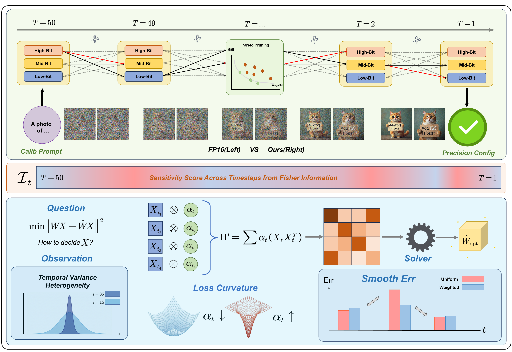
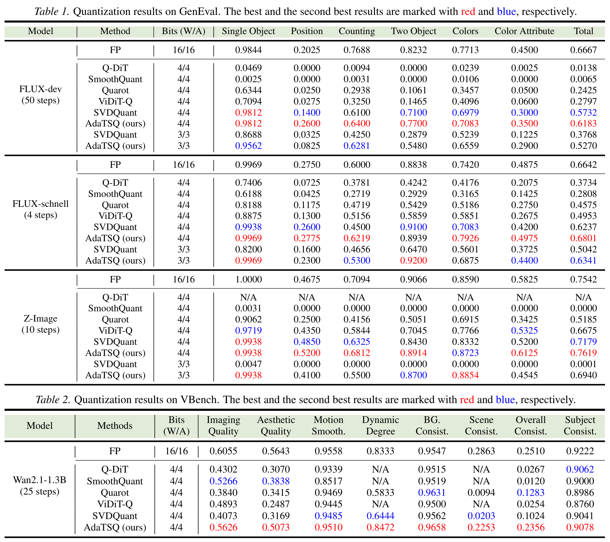
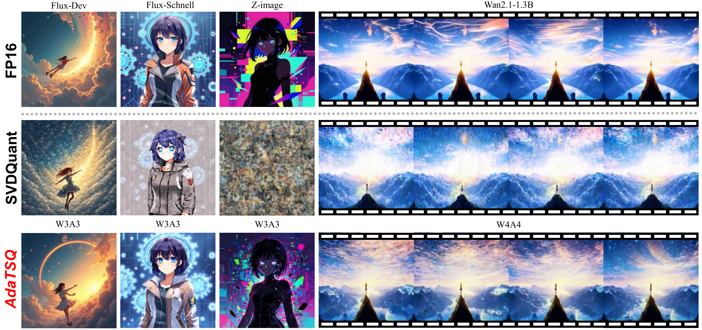
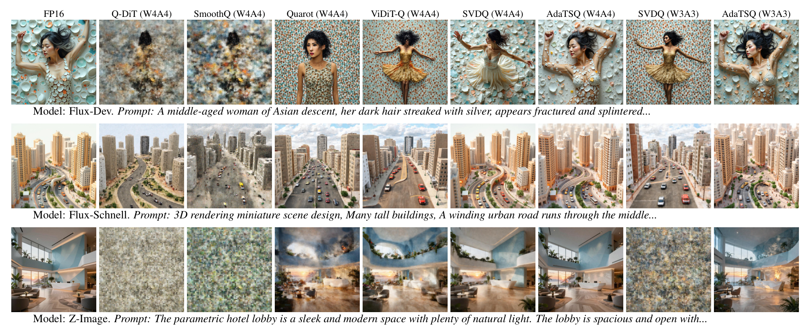
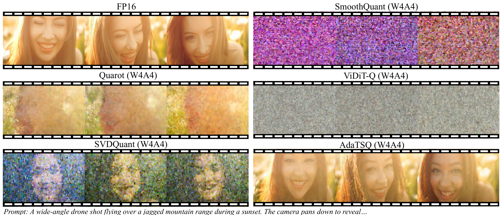

# AdaTSQ: Pushing the Pareto Frontier of Diffusion Transformers via Temporal-Sensitivity Quantization

[Shaoqiu Zhang](https://github.com/Qiushao-E), [Zizhong Ding](https://github.com/Labyrinth0419), Kaicheng Yang, [Junyi Wu](https://junyiwucode.github.io/), Xianglong Yan, Xi Li, Bingnan Duan, Jianping Fang, and [Yulun Zhang](http://yulunzhang.com/),

"AdaTSQ: Pushing the Pareto Frontier of Diffusion Transformers via Temporal-Sensitivity Quantization", arXiv, 2026

[[arXiv](https://arxiv.org/abs/2602.09883)]

#### 🔥🔥🔥 News

- **2026-02-10:** Repo is released. ⭐️⭐️⭐️

---

> **Abstract:** Diffusion Transformers (DiTs) have emerged as the state-of-the-art backbone for high-fidelity image and video generation. However, their massive computational cost and memory footprint hinder deployment on edge devices. While post-training quantization (PTQ) has proven effective for large language models (LLMs), directly applying existing methods to DiTs yields suboptimal results due to the neglect of the unique temporal dynamics inherent in diffusion processes. In this paper, we propose \textbf{AdaTSQ}, a novel PTQ framework that pushes the Pareto frontier of efficiency and quality by exploiting the temporal sensitivity of DiTs. First, we propose a Pareto-aware timestep-dynamic bit-width allocation strategy. We model the quantization policy search as a constrained pathfinding problem. We utilize a beam search algorithm guided by end-to-end reconstruction error to dynamically assign layer-wise bit-widths across different timesteps. Second, we propose a Fisher-guided temporal calibration mechanism. It leverages temporal Fisher information to prioritize calibration data from highly sensitive timesteps, seamlessly integrating with Hessian-based weight optimization. Extensive experiments on four advanced DiTs (\textit{e.g.}, Flux-Dev, Flux-Schnell, Z-Image, and Wan2.1) demonstrate that AdaTSQ significantly outperforms state-of-the-art methods like SVDQuant and ViDiT-Q. Our code will be released soon.



---

## <a name="contents"></a> Contents

- [Contents](#contents)
- [Results](#results)
- [Citation](#citation)

## <a name="results"></a> Results

<details open>
<summary>Click to expand</summary>

- quantitative comparisons in Table 1 and 2 (main paper)

<p align="center">
  
</p>

- visual comparison in Figure 1 (main paper)

<p align="center">
  
</p>

- visual comparison in Figure 6 (main paper)

<p align="center">
  
</p>

- visual comparison in Figure 7 (main paper)

<p align="center">
  
</p>

</details>

## <a name="citation"></a> Citation

If you find the code helpful in your research or work, please cite the following paper(s).

```
@misc{zhang2026adatsqpushingparetofrontier,
      title={AdaTSQ: Pushing the Pareto Frontier of Diffusion Transformers via Temporal-Sensitivity Quantization},
      author={Shaoqiu Zhang and Zizhong Ding and Kaicheng Yang and Junyi Wu and Xianglong Yan and Xi Li and Bingnan Duan and Jianping Fang and Yulun Zhang},
      year={2026},
      eprint={2602.09883},
      archivePrefix={arXiv},
      primaryClass={cs.CV},
      url={https://arxiv.org/abs/2602.09883},
}
```
